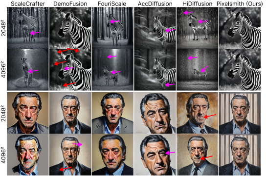
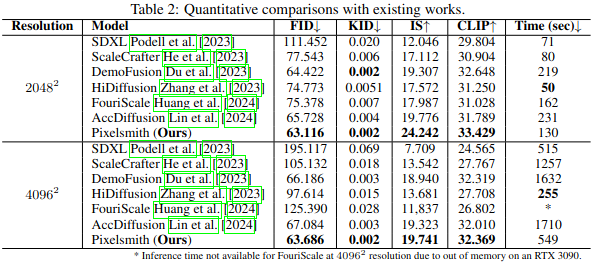
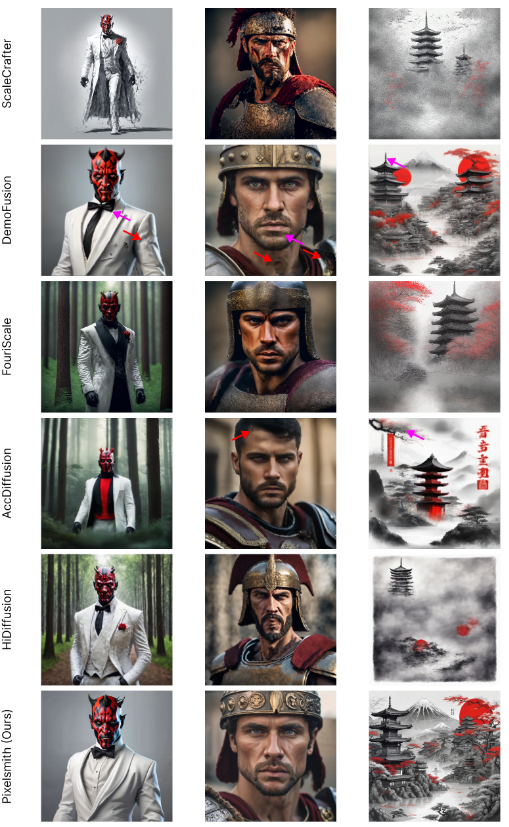

[](https://arxiv.org/abs/2406.07251)
[](https://thanos-db.github.io/Pixelsmith/)


# 🔨Pixelsmith
Official implementation of "Is One GPU Enough? Pushing Image Generation at Higher-Resolutions with Foundation Models." **[NeurIPS 2024]**


## ℹ️Abstract
In this work, we introduce Pixelsmith, a zero-shot text-to-image generative framework to sample images at higher-resolutions with a single GPU. %with minimal computational resources.
We are the first to show that it is possible to scale the output of a pre-trained diffusion model by a factor of 1000, opening the road for gigapixel image generation at no additional cost. Our cascading method uses the image generated at the lowest resolution as a baseline to sample at higher-resolutions. For the guidance, we introduce the Slider, a tunable mechanism that fuses the overall structure contained in the first-generated image with enhanced fine details. At each inference step, we denoise patches rather than the entire latent space, minimizing memory demands such that a single GPU can handle the process, regardless of the image's resolution. Our experimental results show that Pixelsmith not only achieves higher quality and diversity compared to existing techniques, but also reduces sampling time and artifacts.

## 💻Environment
```bash
conda create -n pixelsmith python=3.11
conda activate pixelsmith
conda install pytorch=2.2.1 torchvision=0.17.1 pytorch-cuda=12.1 -c pytorch -c nvidia
pip install -r requirements.txt
```

## 🚀Image generation
```
from pixelsmith_pipeline import generate_image

prompt = "ENTER HERE YOUR PROMPT"
negative_prompt = "ENTER THE NEGATIVE PROMPT"

# starting resolution, also sets the ratio
h_res = 1152    
w_res = 896

seed=None

# base resolution
base_image = generate_image(seed=seed, prompt=prompt, negative_prompt=negative_prompt, h_res=h_res, w_res=w_res)

# base resolution * 2
hr_image_2 = generate_image(seed=seed, prompt=prompt, negative_prompt=negative_prompt, h_res=int(h_res*2), w_res=int(w_res*2), image=base_image, slider=20)

# base resolution * 4
hr_image_4 = generate_image(seed=seed, prompt=prompt, negative_prompt=negative_prompt, h_res=int(h_res*4), w_res=int(w_res*4), image=hr_image_2, slider=30)
```
An example can be found in [getting_started.ipynb](https://github.com/Thanos-DB/Pixelsmith/blob/main/getting_started.ipynb)

## 🥇Comparisons






## 📆History
- __[2025.01.04]__: Pixelsmith is implemented in [automatic](https://github.com/vladmandic/automatic). Many thanks to [Vladimir Mandic](https://github.com/vladmandic)!
- __[2024.10.25]__: Code release.
- __[2024.10.25]__: [Project page](https://thanos-db.github.io/Pixelsmith/) release.
- __[2024.09.25]__: :fire: Pixelsmith has been accepted to NeurIPS 2024!

## License
```
##Dual licensing
This project is licensed under the **[GPL-3.0](LICENSE.md)**.
If you wish to use this software for commercial purposes without restrictions, please contact the authors to discuss licensing terms.
```

## 📚Citation
```bib
	@article{tragakis2025one,
		title={Is One GPU Enough? Pushing Image Generation at Higher-Resolutions with Foundation Models.},
		author={Tragakis, Athanasios and Aversa, Marco and Kaul, Chaitanya and Murray-Smith, Roderick and Faccio, Daniele},
		journal={Advances in Neural Information Processing Systems},
		volume={37},
		pages={41242--41273},
		year={2025}
	}
```
